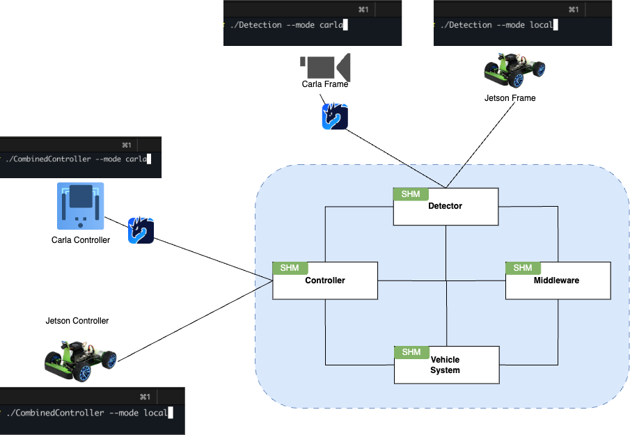

# Jetson Nano ECU — Vehicle Control Stack (Team02-Course submodule)

This repository contains the core software that runs on an NVIDIA Jetson Nano used as an ECU in an autonomous driving lab platform. It is a submodule of the Team02-Course monorepo and provides perception, control, middleware, and tooling required to operate the vehicle in manual and autonomous modes.

Key features:
- Combined Controller: manual control via Xbox controller, PID/MPC steering, and speed PID control.
- Vehicle System: vehicle state model and actuation interface.
- Middleware: CAN <-> Zenoh bridge for battery, lights, speed, etc.
- Perception: lane detection, object detection, ACC, LKAS, traffic light/sign classification.
- Tools: camera calibration, Zenoh router (cloud bridge with InfluxDB), PID calibration, system monitor, VSS helpers.

Architecture:
- IPC is Zenoh-based (pub/sub). Middleware bridges vehicle CAN to Zenoh topics.
- Controllers switch between manual (SAE_0/SAE_1) and autonomous levels, consuming perception outputs to steer and modulate speed.
- Object detection triggers emergency braking and supports ACC (distance/speed tracking).
- Lane detection provides midpoint error for PID and trajectory for MPC.

## Executables

- Vehicle System (src/vehicle.cpp)
  - Holds vehicle state, VSS-aligned signals, and actuates chassis/body.
- Middleware (src/middleware.cpp)
  - Publishes CAN-derived signals (battery, lights, etc.) and converts received CAN to Zenoh (e.g., speed).
- Combined Controller (src/combinedControl.cpp)
  - Threads:
    - ManualControl: reads Xbox inputs, exposes manual speed/steering.
    - PIDController or MPCController: steering control (mode-dependent).
    - SpeedPidController: regulates throttle using desiredSpeed/currentSpeed.
  - Uses manual inputs in manual modes, and perception-derived signals in autonomous modes.
- Detection (src/detection.cpp)
  - Lane Detection: midpoint error for PID and trajectory for MPC.
  - Object Detection: obstacle/road checks, emergency brake, ACC (relative speed), LKAS helpers.
  - Traffic lights/signs: crop and classify; results shared with controller to adjust speed/brake.

## Communication

- Zenoh: primary IPC between components and tools.
- CAN Bus: vehicle-side communication; Middleware bridges to Zenoh.
- VSS: used to structure signals and naming.

## Repository layout

- include/, src/: core code (ADAS, Controllers, Communication, Detection, Vehicle, …)
- config/
  - Zenoh/*.json: component configs
  - Systemd/*.service: systemd units for deployment
- tools/: calibration, PID tuning, system monitor, VSS, zenoh-router
- docs/: diagrams and documentation assets
- deploy/: Dockerfiles and scripts for Jetson deployment

## Build

Prerequisites:
- Jetson Nano (JetPack 4.6+), CUDA (if using perception), OpenCV, Zenoh C/C++ libs, CMake 3.16+

Build:
- On device (recommended):
  - mkdir -p build && cd build
  - cmake ..
  - make -j
- For deployment via systemd, see config/Systemd and deploy/scripts.

## Run (examples)

- Vehicle System:
  - ./build/VehicleSystem
- Middleware:
  - ./build/MiddleWare
- Combined Controller:
  - ./build/CombinedController
- Detection:
  - ./build/Detection

Systemd units (optional):
- config/Systemd/*.service contain ready-to-use services for each component.

## Configuration

- Zenoh configs: config/Zenoh/*.json
- Camera calibration and model parameters: tools/cam_calibration/

## Tools

- zenoh-router: bridge to cloud (InfluxDB plugin) for telemetry
- cam_calibration: camera intrinsic/extrinsic calibration helpers
- pid_calibrator: PID gain tuning
- system_monitor: runtime resource tracking
- vss, zenoh-router helpers

## License

MIT — see LICENSE.

## Team

Developed by Team02 at SEAME Portugal.